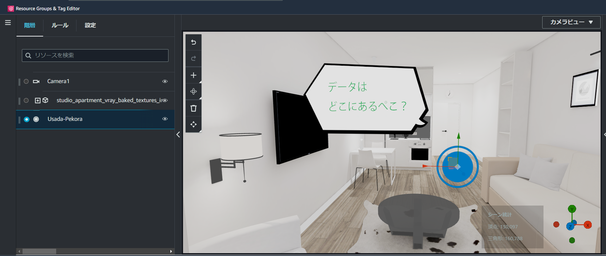
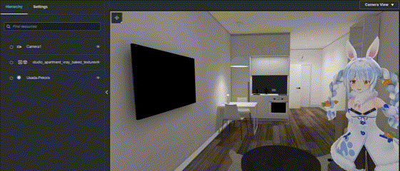
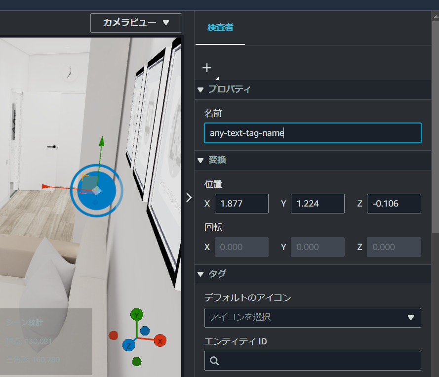

# IoT App Kit Extra

<a href="./README.jp.md">>> README - 日本語版</a>

This library extends the AWS IoT App Kit's Scene Composer.



<div style="text-align:center; font-weight:bold">Tag replace to MMD</div>



- Replaces TwinMaker tag objects to Three.js object (e.g. MMD, buttons, text, etc.)
- Triggers a color change in TwinMaker tags to change the motion of the MMD and the content of the text.

Strongly dependent on IoT App Kit.

https://github.com/awslabs/iot-app-kit

Live Demo

https://shotaoki.github.io/iot-app-kit-extra-document/?content=demo

## Document

https://shotaoki.github.io/iot-app-kit-extra/

## Concept

Easily achieve a range of things that TwinMaker does not implement.

## Requirements

Equivalent to IoT App Kit.

### Language, Environment

- Node.js
- React 18.0 Later
- Typescript
- VSCode

## Usage

### Quick Start

Create new react application with iot-extra.

```bash
npx @iak-extra/cli create ${Application Name}
```

### Installation

Already exists react project, you can install with NPM.

```bash
npm install @iak-extra/scene-composer-extra
```

### Create Tag

Create tags in TwinMaker in advance.

You can name the tag anything you like. For example, you can name it "any-text-tag-name".



### Use it

Simply write the following to replace the tag with the name "any-text-tag-name" with a ThreeMeshUi text object.

```typescript
import { initialize } from "@iot-app-kit/source-iottwinmaker";
import { SceneViewer } from "@iot-app-kit/scene-composer";
import { useOverrideTags } from "@iak-extra/scene-composer-extra";

function App() {
  // Read TwinMaker Scene
  const twinmaker = initialize(/** Certificate */);
  const sceneLoader = twinmaker.s3SceneLoader(/** Scene Info */);

  /** Controller for TwinMaker */
  const controller = useOverrideTags({
    // Replace Tag to Text
    "any-text-tag-name": (replaceTag) =>
      replaceTag.toText?.create({
        content: "TextContents",
      }),
  });

  return (
    <div className="App">
      <SceneViewer
        sceneComposerId={controller.composerId}
        sceneLoader={sceneLoader}
      />
    </div>
  );
}

export default App;
```

Similarly, the tag is replaced by MMD when written as follows.

```typescript
"any-mmd-tag-name": (replaceTag) => {
    replaceTag.toMMD?.create({
        // MMD Initialize Info
    })
}
```

The following will replace the tag with a button.

```typescript
"any-button-tag-name": (replaceTag) => {
    replaceTag.toButton?.create({
        // Button Initialize Info
    })
    .onClickEvent(() => {
      console.log("clicked !!");
    }),
}
```

## Development

Execute the following command to install the library.

```bash
# Execute Directory :: src/scene_composer_extra
npm install
```

Build the library with the following command.

```bash
# Execute Directory :: src/scene_composer_extra
npm run build

# Export To :: package/scene_composer_extra/dist
```

The following command will import the library into your development project.

```bash
npm install ${ProjectRoot}/package/scene_composer_extra
```

The following command pushes to NPM.

```bash
# Execute Directory :: package/scene_composer_extra
npm publish ./
```

## License

The license of this source code is MIT.

The fonts, illustrations, and MMD models included in the resource are the property of their copyright holders and are subject to their licenses.
